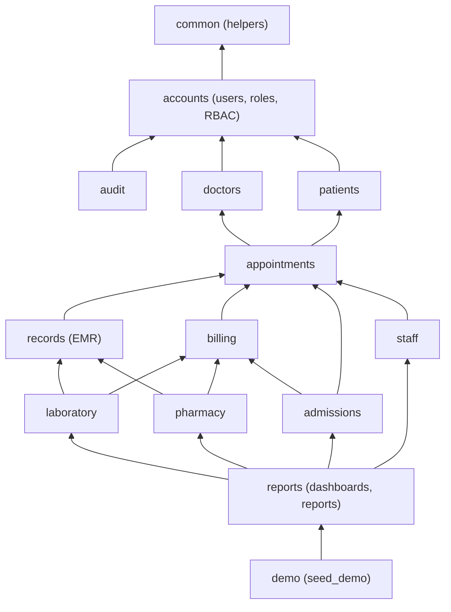
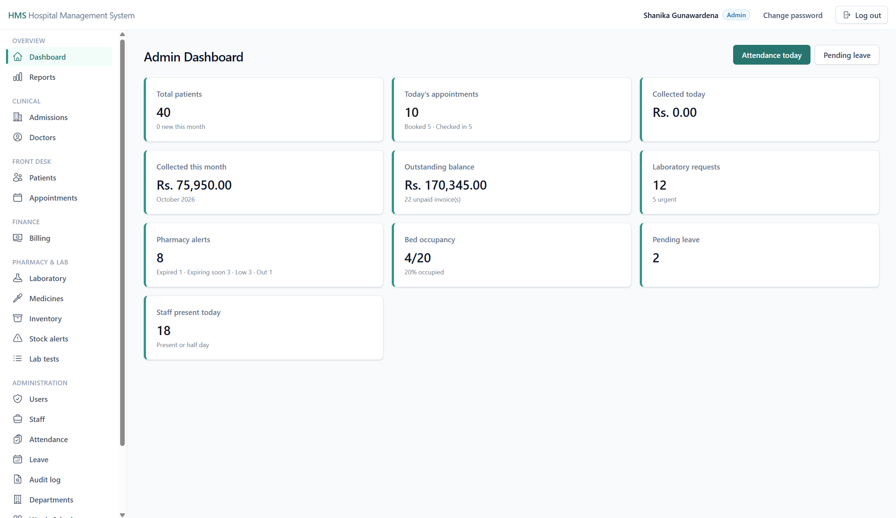
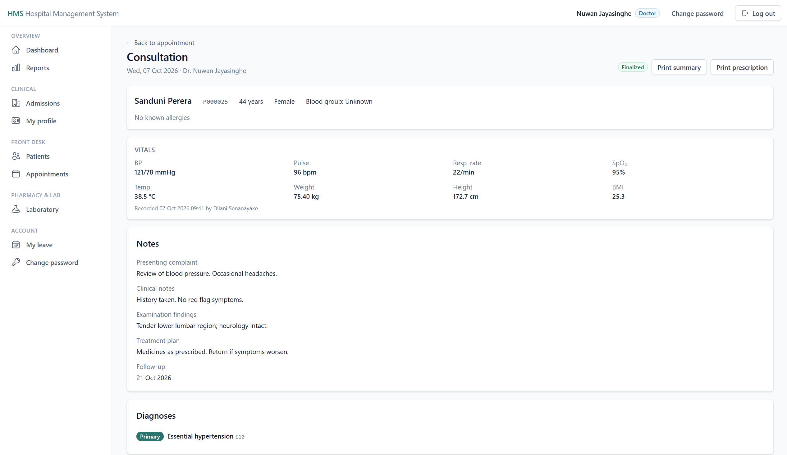
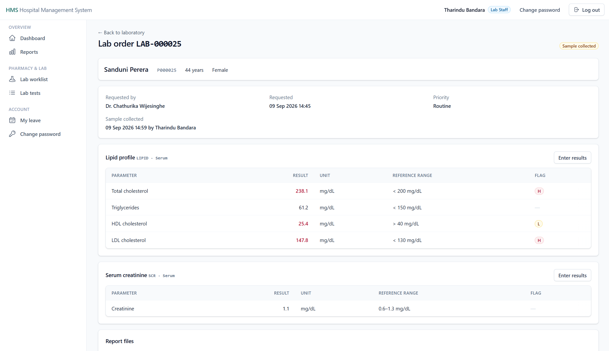
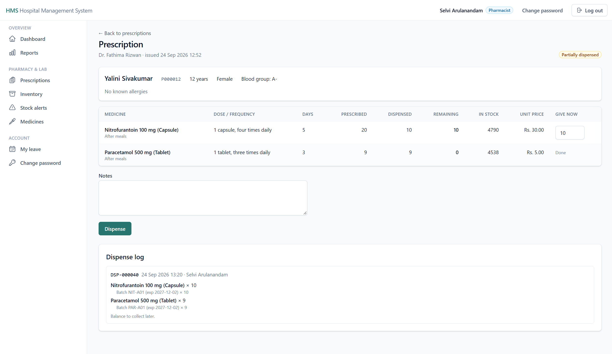
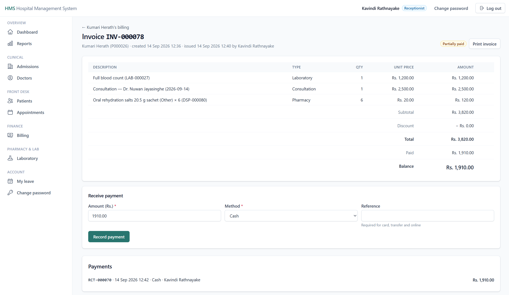
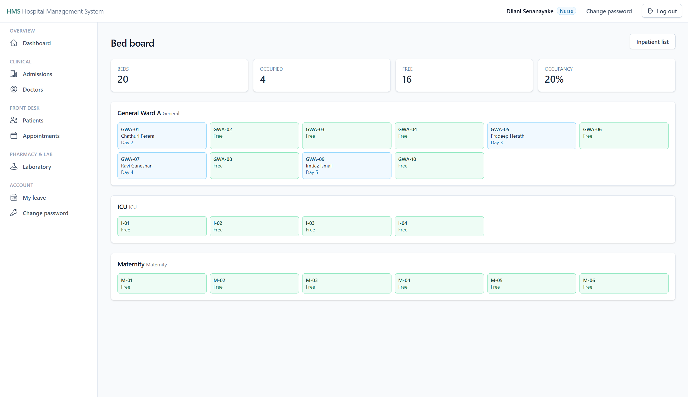
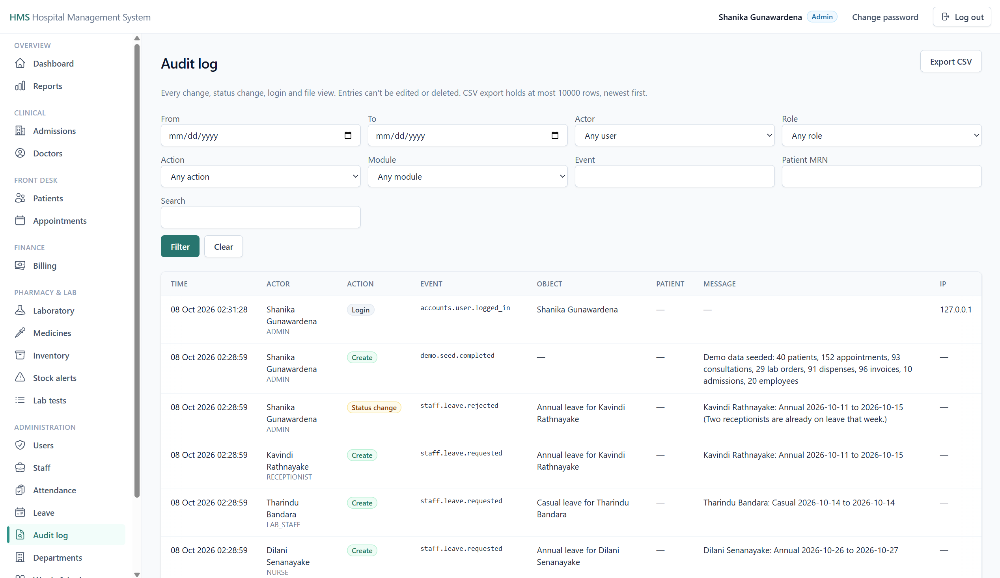
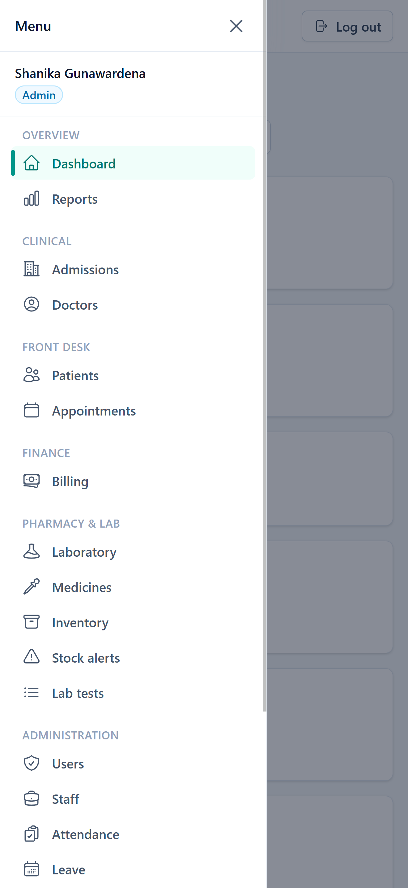

# Hospital Management System

A web-based Hospital Management System (HMS) for day-to-day hospital operations: patients, doctors
and departments, appointments, electronic medical records, laboratory, pharmacy, billing,
admissions, staff, reports and an audit log. Seven staff roles (Admin, Doctor, Nurse,
Receptionist, Lab Staff, Pharmacist, Accountant) each get their own dashboard and sidebar, and
every page checks the user's role on the server. Built with Django 6.1 on Python 3.14,
server-rendered templates with Tailwind CSS, PostgreSQL on Supabase, hosted on Render.

## Live demo

**https://hms-minada.onrender.com/**

The demo runs on Render's free tier: after about 15 minutes without visitors the service sleeps,
and the first request then takes **about a minute** while it starts again. After that, pages load
normally.

## Demo logins

| Username | Role |
|----------|------|
| `demo.admin` | Admin |
| `demo.doctor` | Doctor (General Medicine) |
| `demo.doctor2` | Doctor (Paediatrics) |
| `demo.nurse` | Nurse |
| `demo.reception` | Receptionist |
| `demo.lab` | Lab Staff |
| `demo.pharmacist` | Pharmacist |
| `demo.accountant` | Accountant |

**Password:** provided with the submission email.

All people, NICs, phone numbers and addresses in the demo data are fictional. The data is made by
`python manage.py seed_demo` (see [Local setup](#local-setup-windows-git-bash)), relative to the
day it was seeded.

## Try it in 5 minutes

1. **Reception** (`demo.reception`): the dashboard shows today's queue. Open **Appointments → Book
   appointment**, pick a patient, then a doctor: the page shows the doctor's weekly hours and the
   next dates with free slots. Book one. Open **Billing**, find a patient with unbilled charges,
   create an invoice, issue it, take a payment and print the receipt.
2. **Doctor** (`demo.doctor`): the dashboard lists today's patients with the next step. Open a
   checked-in patient, **Start consultation**, add a diagnosis (ICD-10) and a medicine, request a
   lab test, then **Finalize**. Try prescribing Amoxicillin to a patient whose allergy notes
   mention it: it is blocked until you tick the override.
3. **Lab** (`demo.lab`): **Lab worklist** → open a requested order → *Mark sample collected* →
   *Enter results* (values outside the reference range get an **H**/**L** flag) → *Release* →
   *Print report*.
4. **Pharmacist** (`demo.pharmacist`): **Prescriptions** → open one → dispense part of it. Stock
   is taken first-expiry-first-out; the dispense log shows the batch used. **Stock alerts** shows
   an expired batch, batches expiring soon, low stock and an out-of-stock medicine.
5. **Admin** (`demo.admin`): **Admissions → Bed board**, **Reports** (print or export CSV) and
   **Audit log** (filter by a patient's MRN). Then log in as `demo.nurse` and open `/billing/`:
   you get the 403 page, because the role check is on the server, not just in the menu.

## Spec coverage

| Spec section | App | Where to see it |
|--------------|-----|-----------------|
| 3.1 User management (login, logout, passwords, roles, access control) | `accounts` | `/accounts/login/`, `/accounts/password/`, `/accounts/users/` (Admin) |
| 3.2 Patient management (register, update, search, history, documents) | `patients` | `/patients/`, `/patients/new/`, `/patients/<id>/` (documents), `/patients/<id>/history/` |
| 3.3 Doctor management (add, update, department, schedule) | `doctors` | `/doctors/`, `/doctors/new/`, `/doctors/departments/`, `/doctors/me/` |
| 3.4 Appointment management (book, cancel, reschedule, status) | `appointments` | `/appointments/`, `/appointments/book/`, `/appointments/calendar/` |
| 3.5 Electronic medical records (diagnosis, prescriptions, history, reports) | `records` | Consultation `/records/<id>/`, treatment history `/records/patients/<id>/history/` |
| 3.6 Laboratory (requests, collection, results, reports) | `laboratory` | `/laboratory/`, `/laboratory/walk-in/`, `/laboratory/tests/` |
| 3.7 Pharmacy (inventory, prescriptions, stock, expiry) | `pharmacy` | `/pharmacy/prescriptions/`, `/pharmacy/inventory/`, `/pharmacy/alerts/`, `/pharmacy/medicines/` |
| 3.8 Billing (consultation, lab, pharmacy, admission charges; invoices; payments) | `billing` | `/billing/`, `/billing/patients/` |
| 3.9 Staff (employees, attendance, departments, leave) | `staff` | `/staff/`, `/staff/attendance/`, `/staff/leave/`, `/staff/my-leave/` |
| 3.10 Reports (patients, appointments, revenue, pharmacy, laboratory, staff) | `reports` | `/reports/` |
| Inpatient and outpatient management (scope 1.2) | `admissions` | `/admissions/`, `/admissions/beds/`, `/admissions/wards/` |
| 4 Security: secure login, password hashing, RBAC, audit logs, session timeout | `accounts`, `audit` | `/audit/`; see [Security and NFRs](#security-and-non-functional-requirements) |
| 4 Performance, usability (responsive, easy navigation) | all | Bounded query counts are tested; mobile drawer menu; per-role sidebar |
| 4 Reliability (backup, availability, recovery) | deployment | See [Backups](#backups) and [Known limitations](#known-limitations-and-future-enhancements) |
| 7 Login page | `accounts` | `/accounts/login/` |
| 7 Dashboard (patients, today's appointments, revenue, lab requests, pharmacy alerts) | `reports` | `/dashboard/` (different cards per role) |
| 7 Patient screen (add, edit, search, history) | `patients` | `/patients/` |
| 7 Appointment screen (schedule, calendar, doctor selection) | `appointments` | `/appointments/book/`, `/appointments/calendar/` |
| 7 Billing screen (generate bill, receive payment, print receipt) | `billing` | `/billing/patients/` → patient billing → invoice → receipt |

## Architecture

One Django project (`config/`) with one app per domain. Apps may only depend "downwards"; the
rules below are enforced by `tests/test_dependencies.py`.



An arrow means "may import". The rules the tests check:

- **records, patients and appointments** never import **billing** or **laboratory**; **billing**
  never imports **laboratory**.
- **pharmacy**'s catalog and stock code (`models.py`, `selectors.py`, `services.py`) never imports
  **records**; only `pharmacy/dispensing.py` and `dispensing_selectors.py` connect prescriptions,
  stock and billing, and **records** never imports those two.
- Nothing imports **admissions**, **staff**, **reports** or **demo**.
- **audit** imports only `accounts`, `common` and Django; other apps use only `audit.services`.

**Layering inside each app**

- **Thin views:** check the role, bind the form, call one service or selector, render or
  redirect.
- **`services.py`** owns every create, update, delete and status change, inside
  `transaction.atomic()`, with `select_for_update()` where two people could change the same row,
  and writes one audit entry.
- **`selectors.py`** holds read queries (`select_related`/`prefetch_related`; dashboards and the
  busy pages have query-count tests).
- **Models** validate themselves (`clean()`, `CheckConstraint`, `UniqueConstraint`, partial unique
  indexes), so the database also refuses bad data.
- **Template-tag integration:** a page can show another app's data without a Python import,
  e.g. the consultation page uses `` (laboratory) and
  `` (pharmacy); the owning app runs its own queries.

## Data model

| App | Main models |
|-----|-------------|
| `accounts` | **User** (custom user with one `role`) |
| `doctors` | **Department**; **Doctor** (profile linked one-to-one to a DOCTOR user, fee, SLMC number); **DoctorSchedule** (weekly blocks with slot length) |
| `patients` | **Patient** (MRN `P000123` from the id, NIC, allergies, emergency contact); **PatientDocument** (file in private storage) |
| `appointments` | **Appointment** (doctor, patient, date, slot, status, fee copied at booking) |
| `records` | **MedicalRecord** (one per appointment, draft/finalized); **Vitals**; **Diagnosis** (ICD-10); **Prescription** and **PrescriptionItem**; **RecordAddendum**; **RecordReport** |
| `laboratory` | **LabTest** and **LabTestParameter** (catalog with reference ranges); **LabOrder**, **LabOrderItem**, **LabResult** (unit and range copied in); **LabOrderReport** |
| `pharmacy` | **Medicine**; **StockBatch** (batch number, expiry, quantity on hand); **StockMovement** (signed, append-only ledger); **Dispense** and **DispenseItem** |
| `billing` | **Charge** (with a source such as an appointment or dispense item); **Invoice** (totals computed, never stored); **Payment** |
| `admissions` | **Ward** (daily rate); **Bed**; **Admission**; **BedAssignment** (bed history; occupancy is derived from it); **ProgressNote** (append-only) |
| `staff` | **Employee** (optional link to a login); **Attendance**; **LeaveRequest** |
| `audit` | **AuditLog** (append-only; who, what, when, patient, changed fields) |

## Roles and access

| Module / action | Admin | Doctor | Nurse | Receptionist | Lab Staff | Pharmacist | Accountant |
|-----------------|:-----:|:------:|:-----:|:------------:|:---------:|:----------:|:----------:|
| User accounts | ✓ | | | | | | |
| Departments, doctors and schedules (manage) | ✓ | | | | | | |
| Doctor directory | ✓ | ✓ | ✓ | ✓ | | | |
| Patients: view, search, upload documents | ✓ | ✓ | ✓ | ✓ | | | |
| Patients: register, edit | ✓ | | | ✓ | | | |
| Patient medical history | ✓ | ✓ | ✓ | | | | |
| Appointments: list, calendar | ✓ | own | ✓ | ✓ | | | |
| Appointments: book, reschedule, cancel, no-show | ✓ | | | ✓ | | | |
| Check in | ✓ | | ✓ | ✓ | | | |
| Consultation: write, finalize, addenda | | own | | | | | |
| Record vitals | | own | ✓ | | | | |
| Finalized records, treatment history | ✓ | ✓ | ✓ | | | | |
| Lab: worklist and orders | ✓ | ✓ | ✓ | | ✓ | | |
| Lab: request from a consultation | | own | | | | | |
| Lab: walk-in request | | | | ✓ | ✓ | | |
| Lab: collect, results, release, catalog | catalog | | | | ✓ | | |
| Pharmacy: catalog, inventory, alerts | ✓ | | | | | ✓ | |
| Pharmacy: dispense | view | | | | | ✓ | |
| Billing: view, print | ✓ | | | ✓ | | | ✓ |
| Billing: invoices and payments | | | | ✓ | | | ✓ |
| Billing: discounts, correct manual charges | | | | | | | ✓ |
| Billing: void invoices and payments | ✓ | | | | | | |
| Admissions: list, bed board | ✓ | ✓ | ✓ | ✓ | | | |
| Admit / transfer and notes / discharge | | admit, transfer, discharge | admit, transfer | admit | | | |
| Wards and beds | ✓ | | | | | | |
| Staff, attendance, leave approval | ✓ | | | | | | |
| My leave | any user linked to a current employee record | | | | | | |
| Reports | all | appointments (own) | | patients, appointments | laboratory | pharmacy | revenue |
| Audit log | ✓ | | | | | | |

"own" means only the doctor's own appointments or consultations.

## Security and non-functional requirements

- **Passwords** are hashed with Django's default hasher (PBKDF2); new passwords go through
  Django's password validators. No password is ever logged or shown.
- **Default deny:** `LoginRequiredMiddleware` sends anyone not logged in to the login page; the
  only public pages are the login page and `/healthz/`. Every view also declares the roles it
  allows (`RoleRequiredMixin` / `role_required` in `accounts/permissions.py`); other roles get a
  403 page. Hiding menu links is only cosmetic. A test walks every URL to check that anonymous
  visitors are redirected, and each app's view tests check wrong-role (403) and right-role access.
- **Session timeout:** the session ends after `SESSION_IDLE_TIMEOUT_MINUTES` without a request
  (default 30) and when the browser closes; an open page goes to the login page with a "session
  expired" message.
- **CSRF** protection on every form; **clickjacking** protection (`X-Frame-Options`).
- **HTTPS in production** (`DEBUG=False`): secure session and CSRF cookies, HSTS
  (`SECURE_HSTS_SECONDS`, default one hour), `SECURE_PROXY_SSL_HEADER` for Render's proxy;
  `manage.py check --deploy` must pass in the build and in CI.
- **Audit log** (`/audit/`, Admin): every create, update, delete and status change, plus logins,
  logouts, failed logins, password changes and patient-document views. Each entry is written in
  the same transaction as the change, records only changed fields, never passwords, and can't be
  edited or deleted through the application.
- **Files:** patient documents are stored in a **private** Supabase Storage bucket and only
  served through RBAC-checked views (`Cache-Control: private, no-store`); file types are checked
  from their content and files get random storage names.
- **Secrets** come from environment variables only (`.env` locally, never committed;
  `.env.example` has placeholders).
- **CSV exports** escape cells starting with `=`, `+`, `-`, `@`, tab or carriage return, so a
  spreadsheet never runs them as formulas.
- **Responsive UI:** sidebar becomes a slide-in drawer on phones; tables scroll sideways inside
  their card.

## Tech stack and deployment

| Part | Choice |
|------|--------|
| Language and framework | Python 3.14 (`.python-version`), Django 6.1 |
| UI | Server-rendered Django templates; Tailwind CSS v4 compiled ahead of time to `static/css/app.css` (pinned standalone CLI 4.3.3, see [User interface](#user-interface)) and served by WhiteNoise; Heroicons (MIT) inline |
| Database | PostgreSQL on Supabase (session pooler, `?sslmode=require`, `CONN_HEALTH_CHECKS`); SQLite for local development |
| File storage | Supabase Storage through its S3 API (`django-storages`); local `media/` in development |
| Hosting | Render web service: gunicorn + WhiteNoise for static files |

**Render settings**

| Setting | Value |
|---------|-------|
| Build command | `bash build.sh` (installs requirements, `check --deploy --fail-level WARNING`, `collectstatic`, `migrate`) |
| Start command | `gunicorn config.wsgi:application --bind 0.0.0.0:$PORT` |
| Health check path | `/healthz/` (no login, no database query) |

**Environment variables** (names only; values live in Render and in your local `.env`)

| Name | Purpose |
|------|---------|
| `SECRET_KEY` | Django secret key |
| `DEBUG` | `False` in production |
| `DATABASE_URL` | Database connection (Supabase session pooler in production) |
| `ALLOWED_HOSTS`, `CSRF_TRUSTED_ORIGINS` | Extra hosts; Render's `RENDER_EXTERNAL_HOSTNAME` is added automatically |
| `CONN_MAX_AGE` | Database connection reuse in seconds |
| `SECURE_HSTS_SECONDS`, `SECURE_SSL_REDIRECT` | HTTPS settings (production) |
| `WEB_CONCURRENCY` | gunicorn worker count (read by gunicorn) |
| `LOG_LEVEL` | Logging level |
| `SESSION_IDLE_TIMEOUT_MINUTES` | Idle session timeout (default 30) |
| `SUPABASE_S3_ENDPOINT`, `SUPABASE_S3_REGION`, `SUPABASE_S3_BUCKET`, `SUPABASE_S3_ACCESS_KEY_ID`, `SUPABASE_S3_SECRET_ACCESS_KEY` | Document storage (all five, or none locally) |
| `MAX_UPLOAD_MB` | Largest upload (default 5) |
| `APPOINTMENT_BOOKING_WINDOW_DAYS` | How far ahead appointments can be booked (default 60) |
| `PHARMACY_EXPIRY_WARNING_DAYS` | "Expiring soon" window (default 90) |
| `ADMISSION_BACKDATE_DAYS` | How far back admission events may be entered (default 7) |
| `AUDIT_TRUST_X_FORWARDED_FOR` | `True` on Render, so audit entries record the client IP from the proxy header |
| `MAILER_BACKEND` | Optional email backend (the app sends no email yet) |
| `DEMO_PASSWORD` | Only for `manage.py seed_demo` |

On Render (`RENDER=true`) the app refuses to start without the Supabase Storage variables,
because Render's disk is wiped on every deploy.

## User interface

Pages are server-rendered Django templates styled with **Tailwind CSS v4, compiled ahead of
time** into one static file, `static/css/app.css`, which WhiteNoise serves (with a hashed
file name and long-term caching in production). There is no JavaScript styling step in the
browser, so pages never appear unstyled while CSS is generated.

- **Source:** `assets/css/input.css` holds the design tokens (`@theme`), the component classes
  (`btn`, `card`, `table`, `form-input`, `badge-*`, `alert-*`, …) and the `@source` lines that
  tell Tailwind where class names appear (all templates, plus the few Python files that deal
  with classes). Classes that only reach a page through a template variable are safelisted
  there with `@source inline(...)`.
- **Build:** `bash scripts/build_css.sh` downloads the pinned standalone Tailwind CLI (4.3.3)
  into `tools/` (gitignored) the first time, checks its SHA-256 against the official release
  checksums, and writes the minified `static/css/app.css` (LF line endings, identical bytes on
  Windows and Linux). No Node.js is needed.
- **Committed output:** the built `app.css` is committed; Render's build doesn't compile CSS.
  CI rebuilds it and fails if the committed file differs ("Verify compiled CSS is up to date").
- **After changing classes** in any template (or in `assets/css/input.css`), run
  `bash scripts/build_css.sh` and commit `static/css/app.css` with the change.
- **Print pages** (invoices, receipts, lab reports, prescriptions, discharge summaries,
  printable reports) extend `templates/print/base.html`, which has its own small inline
  stylesheet and doesn't load `app.css`.
- **Icons** are inline Heroicons SVGs with explicit `width`/`height`, so they keep their size
  even if the stylesheet is slow to load.

## Local setup (Windows, Git Bash)

```bash
# 1. Virtual environment and dependencies
py -3.14 -m venv .venv
source .venv/Scripts/activate
python -m pip install -r requirements-dev.txt

# 2. Settings: copy the example and put a new secret key into SECRET_KEY in .env
cp .env.example .env
python -c "from django.core.management.utils import get_random_secret_key; print(get_random_secret_key())"

# 3. Database tables (SQLite by default)
python manage.py migrate

# 4. Demo data: users, doctors, patients and a month of activity (about 15 seconds).
#    The password is read from the environment and never printed.
export DEMO_PASSWORD='choose-a-long-password'
python manage.py seed_demo

# 5. Run at http://127.0.0.1:8000/ and log in as demo.admin (or any demo user)
python manage.py runserver
```

`seed_demo` can be run again safely: it only adds what is missing and never changes existing
data or passwords (use `--reset-passwords` to set the demo users' passwords again). It refuses
to run against a non-SQLite database unless you add `--yes`. Other options: `--seed` (default
42) and `--scale` (0.1–1.0).

## Testing and CI

```bash
python -m pytest                                    # the full test suite
ruff check . && ruff format --check .               # lint and formatting
python manage.py makemigrations --check --dry-run   # no missing migrations
python manage.py check --deploy --fail-level WARNING  # with DEBUG=False and a real SECRET_KEY
```

GitHub Actions (`.github/workflows/ci.yml`) runs all four on every pull request and on pushes to
`dev` and `main`, against PostgreSQL 16. Tests cover models (constraints and validation),
services (business rules, concurrency guards, audit entries), selectors, and every view
(anonymous, wrong role, right role, invalid input).

## Backups

Supabase platform backups depend on the project's plan (see the Supabase documentation). For a
manual backup of the database, run `pg_dump` with the same connection string the app uses:

```bash
pg_dump "$DATABASE_URL" --format=custom --no-owner --file="hms-$(date +%Y%m%d).dump"
# Restore into an empty database:
pg_restore --no-owner --dbname="$TARGET_DATABASE_URL" hms-YYYYMMDD.dump
```

Uploaded documents live in the Supabase Storage bucket and are not part of the database dump.

## Key design decisions

- **Snapshots of prices and ranges:** an appointment keeps the fee agreed at booking, a bed period
  the ward rate when it started, a dispense item the medicine price at that moment, and a lab
  result the unit and reference range when entered. Changing the catalog later never changes a
  past bill or report.
- **Stock ledger:** stock changes only through services that write a signed `StockMovement`;
  movements are never edited, and for every batch they add up to the quantity on hand (tested).
- **FEFO dispensing:** stock is taken from the batch that expires first; expired batches are
  never used; a dispense is all-or-nothing.
- **Idempotent billing:** other modules bill only through `billing.services.post_charge`, which
  returns the existing charge for the same source, so retries and double clicks never bill twice.
  Invoice totals are calculated from charges and payments, never stored.
- **Finalize, then addenda:** a consultation is editable only as a draft by its own doctor;
  finalizing locks it, issues the prescription and completes the appointment in one transaction.
  Later corrections are append-only addenda.
- **Same-transaction audit:** each service writes its audit entry inside its own transaction, so
  the log never records something that was rolled back.
- **Derived state instead of flags:** bed occupancy comes from open bed assignments; invoice
  status follows payments; nothing has to be kept in sync by hand.
- **Database guards for races:** partial unique indexes stop double-booking a slot or a bed even
  if two requests arrive at the same moment; the losing request gets a friendly message.
- **Separation of duties:** cashiers take money, the accountant adjusts bills (discounts,
  corrections), only the admin voids invoices and payments.

## Known limitations and future enhancements

**Not built yet (spec section 12):** mobile application, patient portal (there is no patient
login), SMS and email notifications, telemedicine, insurance integration, AI-based decision
support, biometric authentication.

**Known gaps in this version**

- **Lab results before release:** the consultation, treatment history, patient history and
  dashboards only show released results, but the lab order page shows results as soon as they are
  entered to everyone who can open it (Admin, Doctor, Nurse, Lab Staff).
- **Inpatients:** no inpatient medication chart or prescriptions, no lab orders raised from an
  admission (only from a consultation or as a walk-in), no interim bills during a long stay.
- **Doctor leave doesn't block booking:** approving a doctor's leave warns about their booked
  appointments, but doesn't block new bookings or cancel existing ones.
- **Audit immutability is enforced by the application,** not yet by a database trigger.
- **Hosting:** one free-tier Render instance (cold starts, no high availability); backups are
  manual (see [Backups](#backups)). Document files are not included in database backups.
- **Demo data:** the seed creates no uploaded documents. Audit entries for seeded data carry the
  time the seed ran (audit records when data was written; seeded business data is backdated for
  realism).

## Screenshots

| | |
|---|---|
|  <br> **Admin dashboard:** live numbers that link to the pages behind them. |  <br> **Consultation:** notes, diagnoses, prescription, lab requests and the dispensing card on one page. |
|  <br> **Lab results:** reference ranges and H/L flags. |  <br> **Dispensing:** partial dispensing, FEFO batches and the dispense log. |
|  <br> **Invoice:** charges from every module, discount accountability, payments. |  <br> **Bed board:** occupancy per ward. |
|  <br> **Audit log:** who changed what, filterable by patient. |  <br> **Phone layout:** the sidebar as a slide-in drawer. |
